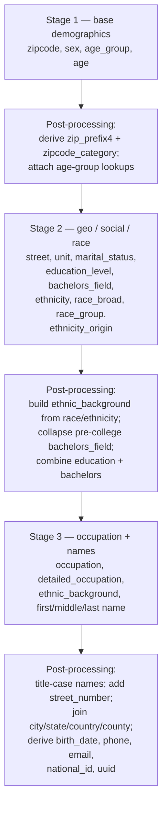

# US Person Generator Example

A worked example of a country-specific persona PGM built on top of the SDG-PGMs framework. The example samples synthetic US-shaped persons with correlated attributes — ZIP code, age, sex, marital status, education, occupation, ethnicity, names, address, phone, email, and a synthetic national ID — using cascaded Bayesian networks with deterministic post-processing between stages.

> **The bundled count tables are intentionally synthetic.** They preserve the schema and categorical structure that a real US implementation would use, but the actual numbers are random and the categorical values (ZIP codes, place names, state codes, ethnic-background labels, etc.) are placeholders. Samples will *not* reflect real US demographics. The example exists so that you can read working code end-to-end and adapt it to your own country with your own data.

---

## What the PGM models

The generator declares 29 variables and assembles them into three cascaded Bayesian networks with deterministic post-processing between each stage. The high-level shape is:



Of those 29, **12 are latent** — used inside the network but dropped from the output: `zipcode_category`, `zip_prefix4`, the base `age_group` and its four `age_group_*` granularities (`marital`, `education`, `bachelors`, `occupation`), `education_level_bachelors`, `ethnicity`, `ethnicity_origin`, `race_broad`, `race_group`. Three further variables (`city`, `state`, `country`) are declared so they can be passed as evidence, but are actually populated in post-processing. The final sample has 23 columns.

### Pipeline at a glance

- **CPDs from counts** for every observed variable (population, age-by-sex-by-zip, marital status, education, bachelors field, occupation, ethnicity, race, names) via `fill_na_and_gen_cpd`.
- **Uniform prior** for `ethnic_background` — it is fully determined in post-processing from `race_group` and `ethnicity_origin`, so the CPD is just a placeholder.
- **`pseudocount=0`** on a few CPDs (street name, unit, detailed occupation) where the support is structural and complete; smoothing isn't needed.
- **Post-processing** adds derived columns (`zip_prefix4`, `zipcode_category`, age-group granularities, `ethnic_background`, `education_level_bachelors`) and synthesizes free-form fields (`street_number`, `city`, `state`, `country`, `county`, `birth_date`, `phone_number`, `email_address`, `national_id`, `uuid`).

### A note on `seed=` reproducibility

`generate_samples(..., seed=N)` only seeds NumPy, which makes the **PGM-sampled columns deterministic**. The post-processing helpers in this example use Python's `random` module (county pick, phone number, SSN, email patterns, birth-date day-of-year, UUID), so the **auxiliary columns are not seed-deterministic**. If you need full reproducibility, seed `random` (and any other generator you use) yourself at the call site.

---

## Running the example

Install the example's extra dependencies (currently just `anyascii` for name transliteration):

```bash
uv sync --extra examples
```

(Re-)build the bundled dummy data — only needed if you've edited `build_dummy_data.py` or the tarfile member names in `PERSON_DATA_TARFILE_PATHS`:

```bash
uv run python -m examples.us_person.build_dummy_data
```

Generate a small sample:

```bash
uv run python -c "from examples.us_person import USPersonGenerator; print(USPersonGenerator().generate_samples(size=5))"
```

Or open the notebook:

```bash
uv run jupyter lab examples/us_person/us_person_generator.ipynb
```

---

## Adapting to another country

The structure here — cascaded PGM stages with deterministic glue between them — applies cleanly to any country with comparable published statistics. A typical port looks like:

1. **Find your target country's analog of each count table.** National statistics agencies are the right source. The schema is what matters: each table is a long-format DataFrame with categorical evidence columns and a `count` column.
2. **Match the schema.** Mirror the column names and categorical states; reuse the same category dtype across DataFrames that share a variable.
3. **Edit the graph and CPDs.** Add or drop variables and edges in `get_variables()`, `get_edges()`, and `get_cpds()` to match what your data supports. Drop US-specific variables (e.g., `ethnic_background`) if they don't apply.
4. **Replace country-specific post-processing.** Swap out the SSN/SSA logic, phone-number area-code mapping, address layout, name distributions, and email locale tables. Treat the helpers in this folder (`us_phone_number_utils.py`, `us_person_field_utils.py`, `email_address_utils.py`) as templates.
5. **Ship real data or write a `build_dummy_data.py` analog.** If your source data is freely redistributable (see below), commit the real tar directly. Otherwise commit a structure-only stand-in like the one here.

---

## Data sourcing and licensing

For the open-source community to benefit from a country-specific PGM, **the source statistics it is built from should be public-domain or permissively-licensed**. The natural sources are official government statistics agencies, for example:

- **USA** — US Census Bureau (public domain by 17 U.S.C. §105)
- **Canada** — Statistics Canada (Open Government Licence — Canada)
- **UK** — Office for National Statistics (Open Government Licence)
- **Vietnam** — General Statistics Office of Vietnam (GSO)
- **Belgium** — Statbel (CC-BY)
- **EU-wide** — Eurostat (CC-BY)

Avoid building on commercial or restrictively-licensed datasets unless you can confirm that the resulting *count tables* and the *PGM outputs sampled from them* do not redistribute the source. Aggregate counts published by a statistical agency at sufficient cell sizes are generally safe; row-level records from a third-party vendor typically are not.

This framework does not provide formal privacy guarantees. For workloads requiring differential privacy or similar protections, see [Safe Synthesizer](https://github.com/NVIDIA-NeMo/Safe-Synthesizer).

---

## Files in this directory

| File | Purpose |
|---|---|
| [`us_person_generator.py`](us_person_generator.py) | `USPersonGenerator` — the `PGMGenerator` subclass: variables, edges, CPDs, post-processing |
| [`data.py`](data.py) | `USPersonData` — Pydantic model that holds the count tables, backed by `TarFileMixin` |
| [`build_dummy_data.py`](build_dummy_data.py) | Deterministic builder for the bundled synthetic tar |
| [`age_utils.py`](age_utils.py) | Age → ISO birth-date sampler |
| [`email_address_utils.py`](email_address_utils.py) | Email synthesis (free-domain + name patterns + birth-year suffixes) |
| [`us_phone_number_utils.py`](us_phone_number_utils.py) | `PhoneNumber` model + ZIP → area-code lookup |
| [`us_person_field_utils.py`](us_person_field_utils.py) | Synthetic phone-number and SSN generation |
| [`us_person_generator.ipynb`](us_person_generator.ipynb) | Notebook walkthrough against the bundled dummy data |
| [`data/person_data.tar`](data/person_data.tar) | Bundled synthetic count tables (20 parquet members) |
| [`data/zip_area_code_map.parquet`](data/zip_area_code_map.parquet) | Bundled synthetic ZIP → area-code map |

---

## Disclaimers

- The bundled count tables are random and do not reflect real US demographics.
- Synthetic national IDs follow the SSN format (`XXX-XX-XXXX`) but are not real SSNs, are not validated against any government source, and are not guaranteed to be in any administratively unassigned range. They are illustrative outputs only.
- State codes, ZIP codes, place names, ethnic-background labels, and surname/given-name distributions in the bundled tar are placeholders, not real US data.
